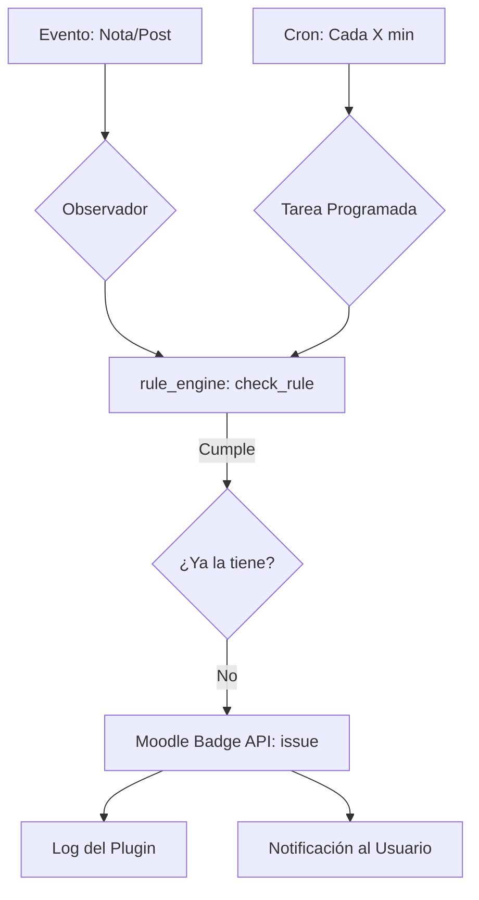

# Análisis Técnico: Lógica de Entrega Automática de Insignias

He analizado a fondo el motor de evaluación y el sistema de entrega. Aquí tienes el desglose detallado de cómo funciona "bajo el capó".

## 1. El Motor de Evaluación (`rule_engine.php`)
Es el corazón del sistema. Centraliza la lógica para decidir si un usuario merece una insignia.
- **Versatilidad de Operadores**: No solo verifica "si tiene nota", sino que permite operaciones complejas (`>=`, `>`, `<=`, `<`, `==`) comparando la nota obtenida vía `grade_get_grades()`.
- **Lógica de Foros**: Realiza consultas directas a la base de datos de Moodle para contar posts, distinguiendo entre hilos nuevos (`topics`) y respuestas (`replies`).
- **Soporte Global**: Tiene métodos específicos (`check_global_rule`) que iteran sobre todas las actividades de un curso para validar criterios masivos.

## 2. Estrategias de Disparo (Triggers)
El sistema usa una estrategia híbrida para asegurar que nadie se quede sin su insignia:

### A. Ejecución en Segundo Plano (Scheduled Task)
- **Archivo**: `classes/task/award_badges_task.php`
- **Funcionamiento**: Un proceso cron que recorre todos los cursos habilitados, todos sus estudiantes y todas sus reglas activas.
- **Ventaja**: Es el "seguro de vida". Si un evento falla o se pierde, este proceso eventualmente encontrará al estudiante y le dará la insignia.
- **Riesgo**: En sitios muy grandes (miles de usuarios), este triple bucle (Cursos > Usuarios > Reglas) puede ser pesado para el servidor.

### B. Eventos en Tiempo Real (Observers)
- **Archivo**: `classes/observer.php`
- **Funcionamiento**: Escucha eventos de Moodle al instante.
    - **Foros**: Cuando alguien publica, se evalúa la regla inmediatamente.
    - **Calificaciones**: [!WARNING] **Punto Crítico Detectado**.

## 3. Hallazgo Crítico (Bug de Calificaciones)
Al analizar `observer::grade_updated`, he detectado una inconsistencia importante:
- Mientras que el resto del plugin usa la tabla `local_automatic_badges_rules`, el observador de notas sigue apuntando a una tabla antigua llamada `local_automatic_badges_criteria`.
- **Efecto**: Las insignias basadas en notas **no se entregan al instante** cuando un profesor pone la nota. El estudiante tiene que esperar a que se ejecute la tarea programada (cron) para recibirla.
- **Recomendación**: Actualizar este observador para que use el `rule_engine` igual que lo hace el de foros.

## 4. Proceso de Emisión e Historial
Una vez que el motor confirma que se cumple la regla:
1. Se valida que el usuario no tenga ya la insignia (`$badge->is_issued`).
2. Se llama a la API core de Moodle (`$badge->issue($userid)`) para la entrega oficial.
3. Se genera un registro en `local_automatic_badges_log`. Este log alimenta la pestaña de "Historial" que configuramos antes, permitiendo ver qué regla disparó cada insignia.

## Resumen de Flujo

http://localhost/moodle/local/automatic_badges/test_logic.php?id=2