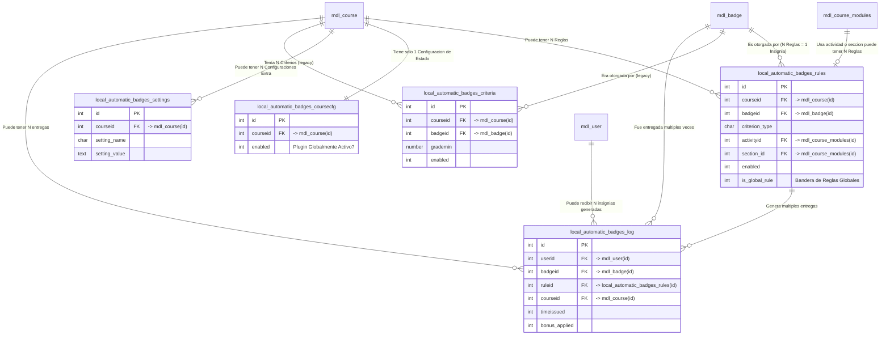

# Modelo de Datos: Automatic Badges

Este documento describe la estructura de base de datos introducida por el plugin `local_automatic_badges`. Incluye el modelo lógico de relaciones y el diccionario de datos detallado de cada tabla.

## 1. Modelo Lógico

A continuación se presenta el **Diagrama Entidad-Relación (ER)** del modelo de datos introducido por el plugin, incluyendo sus relaciones principales con las tablas Core de Moodle.

El plugin introduce 5 tablas que interactúan tanto entre sí como con las tablas core de Moodle.

### Relaciones Principales

*   **`local_automatic_badges_rules` (Reglas de Insignias):**
    *   **N:1 con `mdl_course`:** Cada regla pertenece a un curso (`courseid`).
    *   **N:1 con `mdl_badge`:** Cada regla otorga una insignia específica (`badgeid`).
    *   **N:1 con `mdl_course_modules`:** Opcionalmente, una regla puede referenciar un módulo de curso/actividad específica (`activityid` o `section_id`).
    *   **1:N con `local_automatic_badges_log`:** Una regla puede haber sido aplicada múltiples veces, generando registros de log de las entregas resultantes.
*   **`local_automatic_badges_log` (Historial de Insignias Otorgadas):**
    *   **N:1 con `mdl_user`:** Registra a qué usuario se le otorgó la insignia (`userid`).
    *   **N:1 con `mdl_course`:** Registra en qué curso ocurrió la entrega (`courseid`).
    *   **N:1 con `mdl_badge`:** Registra qué insignia se otorgó (`badgeid`).
    *   **N:1 con `local_automatic_badges_rules`:** Registra qué regla desencadenó la entrega del premio (`ruleid`).
*   **`local_automatic_badges_coursecfg` (Configuración de Estado del Curso):**
    *   **1:1 con `mdl_course`:** Existe máximo un registro por curso para determinar si el plugin está globalmente habilitado en dicho curso de manera ágil.
*   **`local_automatic_badges_settings` (Configuraciones Extendidas por Curso):**
    *   **N:1 con `mdl_course`:** Tabla del tipo clave-valor (KV store) que permite configuraciones adicionales o dinámicas a nivel de curso.
*   **`local_automatic_badges_criteria` (Legacy):**
    *   **N:1 con `mdl_course`, N:1 con `mdl_badge`:** Tabla mantenida estrictamente por propósitos de retrocompatibilidad con las métricas anteriores.

---

## 2. Diccionario de Datos

A continuación se detalla la estructura y propósito de cada campo de las tablas introducidas por el plugin. El esquema se ha derivado de los archivos `install.xml` y `upgrade.php`.

### Tabla: `local_automatic_badges_rules`
**Descripción:** Almacena las reglas configuradas para asignar insignias automáticamente. Centraliza todos los criterios (calificación, foros, entregas, talleres, secciones de curso, etc.).

| Campo | Tipo | Tamaño / Default | Nulo | Comentario / Descripción |
| :--- | :--- | :--- | :---: | :--- |
| `id` | `int` | 10 (PK, Auto) | No | Identificador único de la regla. |
| `courseid` | `int` | 10 | No | ID del curso asociado. FK a `mdl_course`. |
| `badgeid` | `int` | 10 | No | ID de la insignia a otorgar tras el cumplimiento. FK a `mdl_badge`. |
| `criterion_type` | `char` | 50 | No | Tipo de criterio a evaluar (ej. `grade`, `forum`, `forum_grade`, `submission`, `workshop`, `section`). |
| `enabled` | `int` | 1 (Default `1`) | No | Indica si la regla está activa (1) o inactiva (0). |
| `is_global_rule` | `int` | 1 (Default `0`) | No | Indica si es una regla "Global" que debe iterar sobre las actividades automáticamente (1) o afectar sólo a una (0). |
| `activity_type` | `char` | 50 | Sí | Tipo de actividad si es una regla global (ej. `assign`, `quiz`, `forum`, etc.). |
| `activityid` | `int` | 10 | Sí | ID del módulo de curso (FK a `mdl_course_modules`) si el criterio aplica a una actividad única. |
| `grade_min` | `number` | 10,2 | Sí | Calificación mínima requerida por la regla, dependiendo del criterio. |
| `grade_max` | `number` | 10,2 | Sí | Calificación máxima permitida (usado para establecer rangos de calificación). |
| `grade_operator` | `char` | 5 (Default `>=`) | No | Operador lógico de la evaluación de calificación (`>=`, `>`, `<=`, `<`, `==`). |
| `forum_post_count` | `int` | 10 | Sí | Cantidad mínima de mensajes requeridos en un foro para obtener la insignia. |
| `forum_count_type`| `char` | 20 (Default `all`)| Sí | Tipo de mensajes a contar en el foro. Valores previstos: `all` (todos), `replies` (respuestas), `topics` (temas nuevos). |
| `enable_bonus` | `int` | 1 (Default `0`) | No | Si se otorgan puntos extra o bonificaciones de calificación (1) o no se otorgan (0). |
| `bonus_points` | `number` | 10,2 | Sí | Monto numérico de la bonificación a asignar (requiere que `enable_bonus` esté encendido). |
| `bonus_target_activityid` | `int` | 10 | Sí | (Opcional) Indica la actividad específica a la cual dirigir la bonificación extra. |
| `notify_enabled` | `int` | 1 (Default `0`) | No | Controla el envío de notificaciones automáticas en Moodle. |
| `notify_message` | `text` | - | Sí | Mensaje o texto descriptivo utilizado internamente o por el sistema. |
| `require_submitted` | `int` | 1 (Default `1`) | No | Exclusivo para tareas/entregas (`submission`): Indica si es pre-requisito que esté enviado forzosamente. |
| `require_graded` | `int` | 1 (Default `0`) | No | Exclusivo para tareas/entregas (`submission`): Indica si es necesario que un educador lo haya calificado. |
| `submission_type` | `char` | 20 (Default `any`) | Sí | Categórico sobre cómo debe ser la entrega requerida (`any` = cualquiera, `ontime` = a tiempo, `early` = rápida/temprana). |
| `early_hours` | `int` | 10 (Default `24`) | Sí | Cantidad de horas antes de la fecha límite para considerarse una entrega como "early/temprana". |
| `workshop_submission` | `int` | 1 (Default `1`) | Sí | Exclusivo para talleres (`workshop`): Valida que el estudiante hubiese enviado su propio trabajo (1). |
| `workshop_assessments`| `int` | 10 (Default `2`)| Sí | Exclusivo para talleres (`workshop`): Número mínimo de evaluaciones a trabajos de compañeros requerido. |
| `section_id` | `int` | 10 | Sí | Para criterios progresivos de sección (`section`): ID de la sección actual (Tema / Módulo). |
| `section_min_grade` | `number` | 10,2 (Default `60`)| Sí | Calificación promedio mínima requerida dentro de las actividades de esa `section_id`. |
| `dry_run` | `int` | 1 (Default `0`) | No | Modo de "simulación". Si está en `1`, se calcularán los pormenores pero no se emitirá la insignia. |
| `timecreated` | `int` | 10 | No | Timestamp local de Moodle al momento de la creación del registro/regla. |
| `timemodified` | `int` | 10 | No | Timestamp local de la última edición de este registro. |

**Índices:**
- `primary`: sobre columna `id` (LLAVE PRIMARIA).
- `courseid_idx`: sobre columna `courseid` (NO ÚNICA).
- `badgeid_idx`: sobre columna `badgeid` (NO ÚNICA).

---

### Tabla: `local_automatic_badges_log`
**Descripción:** Registro del evento de entrega, conteniendo el desglose de todas las insignias otorgadas y un log de auditoría acerca de las variables adjuntas, como bonos de puntaje en la configuración de *calificaciones naturales*.

| Campo | Tipo | Tamaño / Default | Nulo | Comentario / Descripción |
| :--- | :--- | :--- | :---: | :--- |
| `id` | `int` | 10 (PK, Auto) | No | Identificador numérico del log. |
| `userid` | `int` | 10 | No | Usuario que recibió el beneficio. (FK a `mdl_user`). |
| `badgeid` | `int` | 10 | No | Insignia expedida. (FK a `mdl_badge`). |
| `ruleid` | `int` | 10 | No | Regla gatillo del evento. (FK local a `local_automatic_badges_rules`). |
| `courseid` | `int` | 10 | No | Curso desde donde surtió efecto. (FK a `mdl_course`). |
| `timeissued` | `int` | 10 | No | Timestamp epoch del sistema al momento de la entrega. |
| `bonus_applied` | `int` | 1 (Default `0`) | No | Bandera afirmativa (1) alertando de que se aplicaron exitosamente bonificaciones a la calificación del estudiante. |
| `bonus_value` | `number` | 10,2 | Sí | Valor específico de los puntos extra aplicados. |

**Índices:**
- `primary`: sobre columna `id` (LLAVE PRIMARIA).
- `userid_idx`: sobre columna `userid` (NO ÚNICA).
- `badgeid_idx`: sobre columna `badgeid` (NO ÚNICA).
- `ruleid_idx`: sobre columna `ruleid` (NO ÚNICA).

---

### Tabla: `local_automatic_badges_settings`
**Descripción:** Almacena extensiones de configuración específicas del plugin, definidas dinámicamente o misceláneamente a modo Diccionario/Lista (por Curso y Parametrización Clave=Valor).

| Campo | Tipo | Tamaño / Default | Nulo | Comentario / Descripción |
| :--- | :--- | :--- | :---: | :--- |
| `id` | `int` | 10 (PK, Auto) | No | Identificador único numérico. |
| `courseid` | `int` | 10 | No | Identificador del curso particular. |
| `setting_name` | `char` | 100 | No | Nombre / Clave del parámetro configurado en el curso. |
| `setting_value` | `text` | - | Sí | Valor guardado, opcionalmente puede ser un texto largo. |

**Índices:**
- `primary`: sobre columna `id` (LLAVE PRIMARIA).
- `courseid_idx`: sobre columna `courseid` (NO ÚNICA).

---

### Tabla: `local_automatic_badges_coursecfg`
**Descripción:** Entidad auxiliar que optimiza o cachea de manera permanente que el plugin pueda estar activo/inactivo por todo un curso (facilitando la exclusión en llamadas de "observer", sin depender sólo de *Custom Fields*).

| Campo | Tipo | Tamaño / Default | Nulo | Comentario / Descripción |
| :--- | :--- | :--- | :---: | :--- |
| `id` | `int` | 10 (PK, Auto) | No | Identificador numérico interno de la tabla. |
| `courseid` | `int` | 10 | No | El curso al que corresponde este estado. (FK a `mdl_course`). |
| `enabled` | `int` | 1 (Default `0`) | No | Conmutador principal global del curso para aceptar el plugin (1 activo / 0 inactivo). |
| `timecreated`| `int` | 10 | Sí | Timestamp de creación del registro. |
| `timemodified`| `int` | 10 | Sí | Timestamp de la última modificación sufrida. |

**Índices:**
- `primary`: sobre columna `id` (LLAVE PRIMARIA).
- `courseid_idx`: sobre columna `courseid` **(ÚNICA)** garantizando solo 1 estado por curso.

---

### Tabla: `local_automatic_badges_criteria` (Legacy)
**Descripción:** Tabla heredada con los campos originales en las primeras iteraciones del plugin. Mantenida en el esquema nativo como compatibilidad anterior por si en futuras intervenciones a las bases de datos externas se reanuda la correspondencia al motor o a la sincronización.

| Campo | Tipo | Tamaño / Default | Nulo | Comentario / Descripción |
| :--- | :--- | :--- | :---: | :--- |
| `id` | `int` | 10 (PK, Auto) | No | Identificador (PK). |
| `courseid` | `int` | 10 | No | ID del Curso (FK). |
| `badgeid` | `int` | 10 | No | ID de la insignia (FK). |
| `grademin` | `number` | 10,2 | Sí | Monto numérico limitante a superar. |
| `enabled` | `int` | 1 (Default `1`) | No | Bandera de activación booleana. |
| `timecreated` | `int` | 10 | Sí | Fecha en formato Unix Moodle de su creación. |
| `timemodified`| `int` | 10 | Sí | Fecha de modificación. |

**Índices:**
- `primary`: sobre columna `id` (LLAVE PRIMARIA).
- `courseid_idx`: sobre columna `courseid` (NO ÚNICA).
- `badgeid_idx`: sobre columna `badgeid` (NO ÚNICA).
