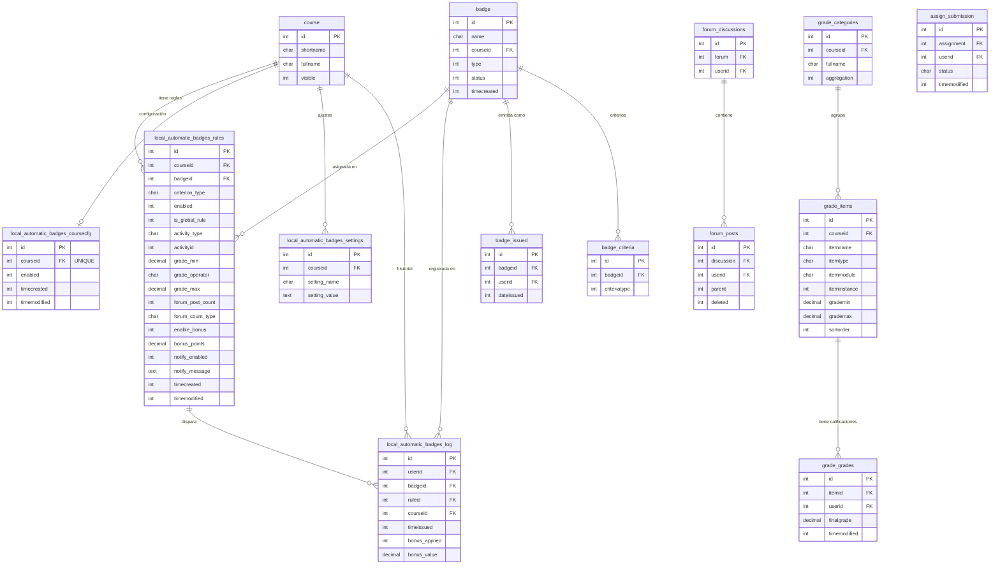

# Modelo Lógico — local_automatic_badges

> Versión del plugin: **0.6.0** · Fecha: 2026-03-24

---

## 1. Visión General

El plugin **Automatic Badges** automatiza la entrega de insignias de Moodle basándose en reglas configurables por curso. Combina tres mecanismos de disparo: eventos en tiempo real, tarea cron en lote, y evaluación manual (modo prueba).

```
┌──────────────────────────────────────────────────────────────────┐
│                        AUTOMATIC BADGES                          │
│                                                                  │
│  Entrada de datos          Lógica central         Salidas        │
│  ─────────────────         ──────────────         ───────        │
│  Formulario de regla  ──►  rule_engine        ──► badge::issue() │
│  Evento de nota       ──►  rule_manager       ──► log entry      │
│  Evento de foro       ──►  helper             ──► bonus_points   │
│  Tarea cron           ──►  bonus_manager      ──► notificación   │
│  Editor de insignia   ──►  dry_run_evaluator  ──► badge image    │
└──────────────────────────────────────────────────────────────────┘
```

---

## 2. Diagrama Entidad-Relación



---

## 3. Tablas Propias del Plugin

### 3.1 `local_automatic_badges_rules` — Reglas

Tabla principal. Cada fila define UNA regla: qué condición debe cumplirse, en qué actividad/ítem, y qué insignia otorgar.

| Campo | Tipo | Nulo | Por defecto | Descripción |
|---|---|---|---|---|
| `id` | INT | NO | — | PK autoincrement |
| `courseid` | INT | NO | — | FK → course.id |
| `badgeid` | INT | NO | — | FK → badge.id |
| `criterion_type` | CHAR(50) | NO | — | `grade` · `forum_grade` · `grade_item` · `forum` · `submission` · `section` |
| `enabled` | INT(1) | NO | `1` | 1 = activa, 0 = deshabilitada |
| `is_global_rule` | INT(1) | NO | `0` | 1 = aplica a todas las actividades del tipo |
| `activity_type` | CHAR(50) | SÍ | NULL | Tipo de módulo para reglas globales (quiz, assign…) |
| `activityid` | INT | SÍ | NULL | cmid de la actividad **o** grade_item.id si criterion=`grade_item` |
| `grade_min` | DECIMAL(10,2) | SÍ | NULL | Umbral mínimo (porcentaje 0–100) |
| `grade_operator` | CHAR(5) | NO | `>=` | Operador: `>=` `>` `==` `range` |
| `grade_max` | DECIMAL(10,2) | SÍ | NULL | Límite superior para operador `range` |
| `forum_post_count` | INT | SÍ | NULL | Publicaciones requeridas |
| `forum_count_type` | CHAR(20) | SÍ | `all` | `all` · `replies` · `topics` |
| `require_submitted` | INT(1) | SÍ | NULL | Entrega requerida (criterion=`submission`) |
| `require_graded` | INT(1) | SÍ | NULL | Calificación publicada requerida |
| `submission_type` | CHAR(20) | SÍ | NULL | `any` · `ontime` · `early` |
| `early_hours` | INT | SÍ | NULL | Horas antes del plazo para entrega anticipada |
| `section_min_grade` | DECIMAL(10,2) | SÍ | NULL | Promedio mínimo para criterion=`section` |
| `enable_bonus` | INT(1) | NO | `0` | 1 = aplicar puntos extra |
| `bonus_points` | DECIMAL(10,2) | SÍ | NULL | Puntos a añadir al libro de calificaciones |
| `notify_enabled` | INT(1) | NO | `0` | 1 = enviar notificación |
| `notify_message` | TEXT | SÍ | NULL | Mensaje personalizado |
| `timecreated` | INT | NO | — | Timestamp Unix de creación |
| `timemodified` | INT | NO | — | Timestamp Unix de última modificación |

**Índices:** `courseid`, `badgeid`

---

### 3.2 `local_automatic_badges_log` — Historial

Registro inmutable de cada insignia otorgada por el plugin.

| Campo | Tipo | Descripción |
|---|---|---|
| `id` | INT PK | Autoincrement |
| `userid` | INT | Usuario que recibió la insignia |
| `badgeid` | INT | Insignia otorgada |
| `ruleid` | INT | Regla que disparó el otorgamiento |
| `courseid` | INT | Contexto de curso |
| `timeissued` | INT | Timestamp del otorgamiento |
| `bonus_applied` | INT(1) | 1 si se aplicaron puntos extra |
| `bonus_value` | DECIMAL(10,2) | Valor del bono aplicado |

**Índices:** `userid`, `badgeid`, `ruleid`

---

### 3.3 `local_automatic_badges_settings` — Ajustes por Curso

Pares clave-valor para configuración por curso.

| Campo | Descripción |
|---|---|
| `courseid` | Curso al que aplica |
| `setting_name` | Nombre del ajuste (p. ej. `default_notify_message`) |
| `setting_value` | Valor del ajuste |

---

### 3.4 `local_automatic_badges_coursecfg` — Habilitación por Curso

Un registro por curso. Controla si el plugin está activo en ese curso.

| Campo | Descripción |
|---|---|
| `courseid` | UNIQUE FK → course.id |
| `enabled` | 1 = activo, 0 = inactivo |

---

## 4. Tablas Core de Moodle Utilizadas

| Tabla | Acceso | Propósito |
|---|---|---|
| `badge` | R/W | Crear, clonar y activar insignias |
| `badge_issued` | R | Verificar si usuario ya tiene la insignia |
| `badge_criteria` | W | Crear criterios al diseñar insignia |
| `badge_criteria_param` | W | Parámetros del criterio (roles) |
| `grade_items` | R | Obtener escala (grademin/max) y lista de ítems |
| `grade_grades` | R | Leer calificación final del usuario |
| `grade_categories` | R/W | Leer categorías; crear categoría de bonificaciones |
| `forum_posts` | R | Contar publicaciones del usuario |
| `forum_discussions` | R | Filtrar por foro específico |
| `assign_submission` | R | Verificar estado de entrega |
| `course` | R | Iterar cursos activos |
| `user` | R | Datos del estudiante |
| `role` · `role_assignments` · `context` | R | Identificar estudiantes por rol |

---

## 5. Arquitectura de Clases

```
namespace local_automatic_badges
│
├── rule_engine          ← Evaluación de criterios (stateless, solo static)
│     Entradas: $rule (stdClass), $userid
│     Salida:   bool (cumple / no cumple)
│
├── rule_manager         ← CRUD de reglas + ciclo de vida de insignia
│     Entradas: form data, courseid
│     Salidas:  ruleid, notificaciones, resultados de generación global
│
├── helper               ← Utilidades de consulta (actividades, estudiantes, ítems)
│
├── bonus_manager        ← Escritura de puntos extra en libro de calificaciones
│
├── observer             ← Listeners de eventos en tiempo real
│     grade_updated  →  dispara evaluación de reglas tipo grade/forum_grade
│     post_created   →  dispara evaluación de reglas tipo forum
│
├── dry_run_evaluator    ← Simulación sin otorgar insignias + render HTML
│
├── hook_callbacks       ← Inyección de UI en páginas de Moodle core
│
└── task/
      award_badges_task  ← Tarea cron: evaluación masiva de todos los cursos
```

---

## 6. Flujos de Datos

### 6.1 Otorgamiento en Tiempo Real (evento de nota)

```
[Moodle core guarda calificación]
        │
        ▼  core\event\grade_updated
observer::grade_updated()
        │
        ├─ helper::is_enabled_course()  ──► false → salir
        │
        ├─ Obtener reglas activas del curso (criterion_type: grade / forum_grade)
        │
        └─ Para cada regla:
                │
                ├─ rule_engine::check_rule($rule, $userid)
                │       │
                │       └─ get_grade_for_cmid()
                │               └─ grade_get_grades() → normalizar a %
                │
                ├─ badge_issued? → sí: omitir
                │
                ├─ badge::issue($userid) ─────────────────► badge_issued
                ├─ INSERT local_automatic_badges_log ──────► historial
                └─ bonus_manager::apply_bonus() ───────────► grade_grades
```

### 6.2 Otorgamiento en Lote (tarea cron)

```
award_badges_task::execute()
        │
        ├─ SELECT DISTINCT courseid FROM rules WHERE enabled=1
        │
        └─ Para cada curso:
                │
                ├─ is_enabled_course() → false: omitir
                ├─ get_students_in_course() → lista de userids
                ├─ GET reglas habilitadas del curso
                │
                └─ Para cada (estudiante × regla):
                        │
                        ├─ rule_engine::check_rule()
                        │     ├─ grade       → get_grade_for_cmid()
                        │     ├─ grade_item  → grade_items + grade_grades directo
                        │     ├─ forum       → COUNT(forum_posts)
                        │     ├─ submission  → assign_submission.status
                        │     └─ section     → promedio de actividades en sección
                        │
                        ├─ ¿Ya tiene insignia? → sí: omitir
                        ├─ badge::issue()
                        ├─ INSERT log
                        └─ apply_bonus() si aplica
```

### 6.3 Creación de Regla Global

```
Formulario global rule
        │
rule_manager::generate_global_rules()
        │
        ├─ get_fast_modinfo() → CMs del tipo seleccionado
        │
        └─ Para cada actividad:
                ├─ helper::clone_badge(baseBadgeId) → nuevo badge con imagen
                ├─ build_rule_record() con activityid = cmid
                ├─ save_rule() → INSERT rules
                └─ activate_badge_if_needed()
```

### 6.4 Diseñador de Insignias → Moodle

```
Usuario diseña en Fabric.js canvas
        │
        ├─ canvas.toDataURL('png', multiplier:2) → base64
        │
POST ajax/save_badge_design.php
        │
        ├─ base64_decode() + validar tipo imagen
        ├─ INSERT badge (status=INACTIVE)
        ├─ badges_process_badge_image() → recorte + thumbnails
        ├─ INSERT badge_criteria (OVERALL + MANUAL)
        ├─ badge::set_status(ACTIVE)
        └─ return { success, badgeid }
```

---

## 7. Jerarquía de Habilitación

Para que una insignia sea otorgada, **las tres capas** deben estar activas:

```
Nivel 1: Plugin global
    local_automatic_badges_coursecfg.enabled = 1
              │
              ▼
Nivel 2: Campo personalizado de curso
    helper::is_enabled_course() → custom_field 'automatic_badges_enabled'
              │
              ▼
Nivel 3: Regla individual
    local_automatic_badges_rules.enabled = 1
              │
              ▼
         Evaluación y otorgamiento
```

---

## 8. Normalización de Calificaciones

Todas las calificaciones se convierten a **porcentaje (0–100)** antes de comparar:

```
porcentaje = ((nota_raw − grademin) / (grademax − grademin)) × 100
```

Esto permite definir reglas con umbrales uniformes independientemente de si la actividad puntúa sobre 5, 10, 20 ó 100.

---

## 9. Sistema de Bonificaciones

Cuando `enable_bonus = 1` y la insignia es otorgada:

```
bonus_manager::apply_bonus()
        │
        ├─ ensure_bonus_category()
        │       └─ grade_categories: "Bonificaciones (Auto Badges)"
        │               (se crea solo si no existe)
        │
        ├─ ensure_bonus_grade_item()
        │       └─ grade_items:
        │               itemtype  = 'manual'
        │               idnumber  = 'auto_badges_bonus_r{ruleid}'
        │               categoryid → bonus_category.id
        │
        └─ grade_item::update_final_grade(userid, bonus_points)
                └─ grade_grades: finalgrade += bonus_points
```

> Los puntos se aplican **una sola vez** por estudiante. No inflan la nota máxima del curso.

---

## 10. Tipos de Criterio

| Criterio | Tabla evaluada | Campo clave | Normalización |
|---|---|---|---|
| `grade` | `grade_grades` vía cmid | `finalgrade` | Sí (% sobre grademax) |
| `forum_grade` | `grade_grades` vía cmid foro | `finalgrade` | Sí |
| `grade_item` | `grade_grades` directo por itemid | `finalgrade` | Sí |
| `forum` | `forum_posts` + `forum_discussions` | `COUNT(p.id)` | No (conteo absoluto) |
| `submission` | `assign_submission` | `status` + tiempo | No |
| `section` | promedio de actividades de la sección | múltiples | Sí |

---

## 11. Puntos de Entrada (UI)

| URL | Propósito |
|---|---|
| `/local/automatic_badges/course_settings.php?id=X` | Hub principal del curso (pestañas: Reglas · Insignias · Historial · Ajustes) |
| `/local/automatic_badges/add_rule.php?id=X` | Crear regla individual |
| `/local/automatic_badges/edit_rule.php?id=X&ruleid=Y` | Editar regla existente |
| `/local/automatic_badges/add_global_rule.php?id=X` | Crear regla global (multi-actividad) |
| `/local/automatic_badges/pages/badge_designer.php?id=X` | Editor visual de insignias (canvas Fabric.js) |
| `/local/automatic_badges/export.php?id=X` | Exportar historial a CSV/Excel |

---

## 12. Endpoints AJAX

| Archivo | Parámetros entrada | Respuesta |
|---|---|---|
| `ajax/load_activities.php` | `courseid`, `criterion_type`, `modname` | JSON array · HTML `<select>` |
| `ajax/save_badge_design.php` | `courseid`, `name`, `imagedata` (base64) | `{success, badgeid, message}` |

---

*Generado el 2026-03-24 — plugin v0.6.0*
